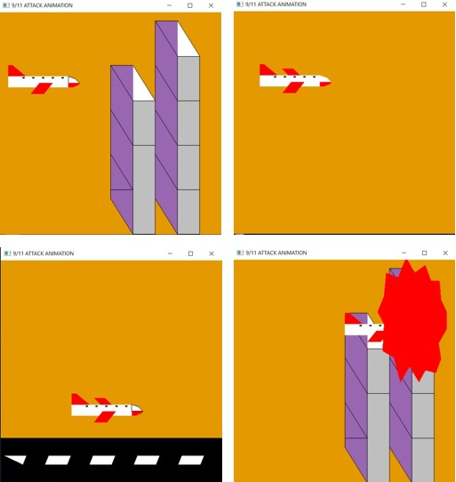

# Computer-Graphics-MiniProject

VTU 6th sem CSE Computer graphics mini project using OpenGL with CodeBlocks.
The project is a graphic version of the 9/11 aeroplane crash on the World Trade Center USA.
It consists of 3 frames- 1)Plane Take-off 2)Plane flyby and 3)Plane crash on the twin tower.

## How To Run Project:
1) Follow this detailed instructions on installing OpenGL on Windows/Linux: https://www.youtube.com/watch?v=kbdPTNzyeIM
2) Clone the repository
3) Run the .c file on CodeBlocks on Windows or follow the steps from the video to run the program on Linux environments.

# NOTE:
### This Project is for education only and not for monetary purpose.
